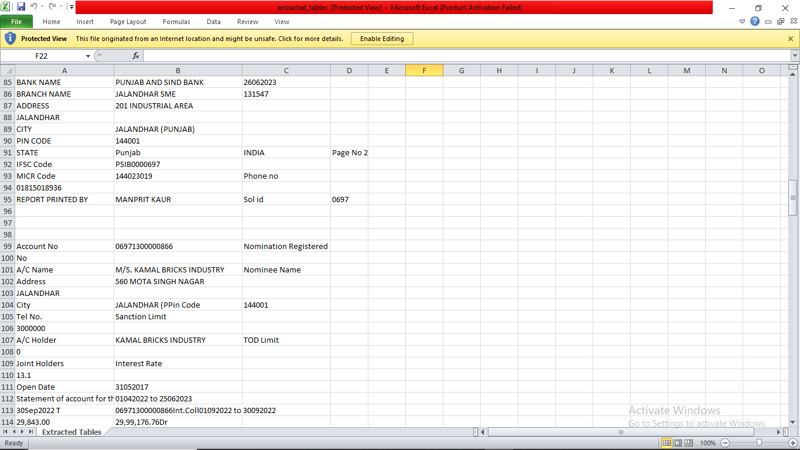
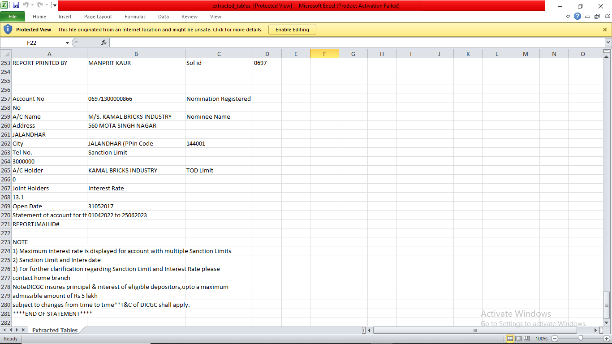

# Daksh_hackathon_scoreme
Hackathon_Question_scoreme

# Table Extraction from PDFs

## Overview
This project is a table extraction tool that detects and extracts tables from system-generated PDFs without using Tabula, Camelot, or converting PDFs to images. The extracted tables are saved in an Excel sheet while maintaining their structure.

## Features
- Detects and extracts tables from PDFs (with or without borders, and irregular shapes).
- Stores extracted tables in an Excel sheet.
- Handles multi-line cells and irregular table structures.
- Uses `PyMuPDF` (fitz) for PDF processing and `openpyxl` for Excel manipulation.
- Efficient and accurate table extraction.

## Requirements
- Python 3.x
- Required Libraries:
  - `pymupdf` (PyMuPDF)
  - `openpyxl`
  - `re`

## Installation
1. Clone the repository:
   ```bash
   git clone <repository_link>
   cd <repository_name>
   ```
2. Install dependencies:
   ```bash
   pip install pymupdf openpyxl
   ```

## Usage
1. Place the PDF file in the project directory.
2. Run the script:
   ```bash
   python extract_tables.py
   ```
3. The extracted tables will be saved in an Excel file (`extracted_tables.xlsx`).

## Code Explanation
The script performs the following steps:
1. Loads the PDF using `PyMuPDF`.
2. Extracts text from the document.
3. Cleans the text by removing colons, dashes, and unnecessary spaces.
4. Identifies and structures tabular data.
5. Saves the extracted tables to an Excel file using `openpyxl`.

## Example Output
For an input PDF file `sample.pdf`, the output will be saved as `extracted_tables.xlsx` containing structured tables.

## Error Handling
- If the PDF file is not found, an error message is displayed.
- If the extracted text contains unsupported characters, they are removed to prevent issues with Excel formatting.

## Future Enhancements
- Improve table structure detection for complex layouts.
- Implement better handling for merged cells and irregular tables.
- Add a GUI for ease of use.

## 📷 Screenshot of the Output

Here is a preview of the extracted table:






